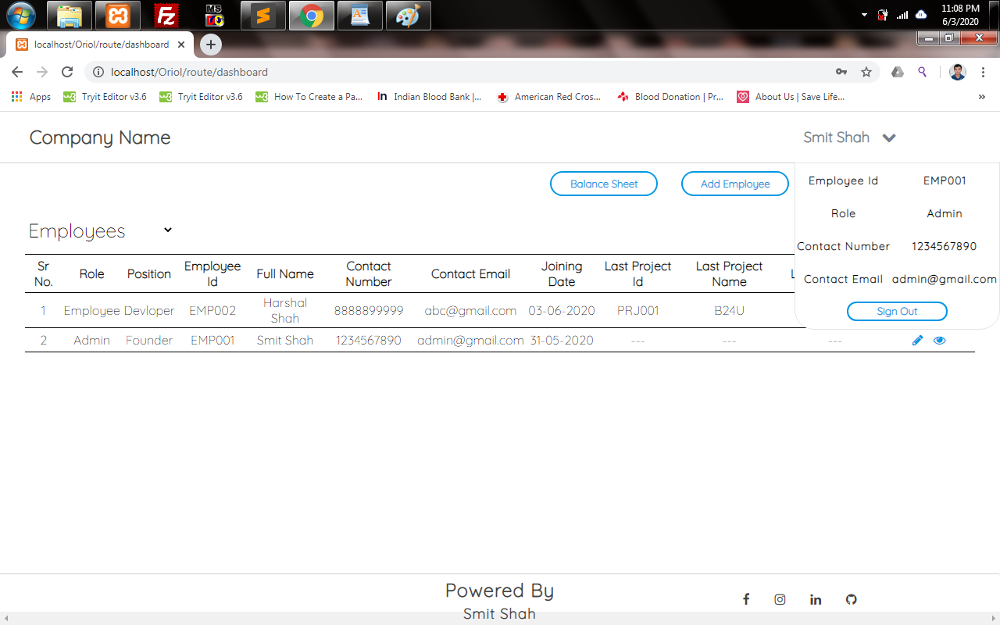
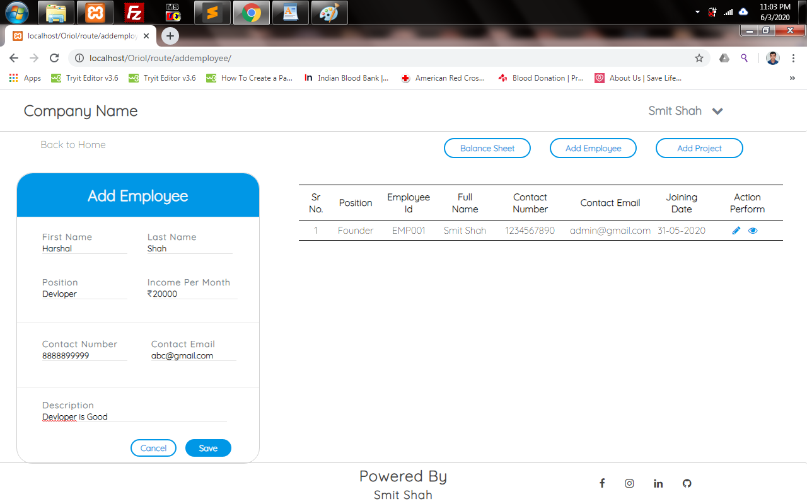
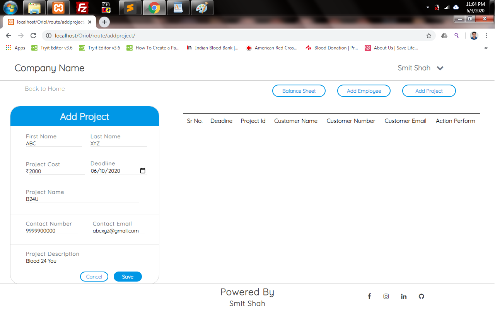
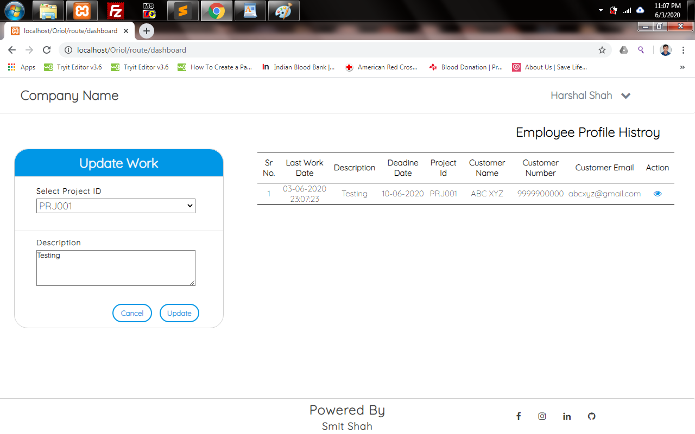
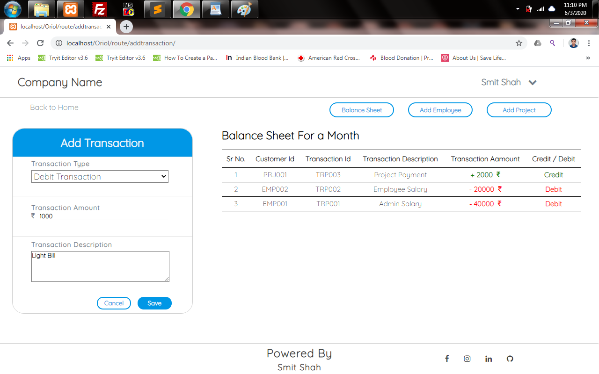
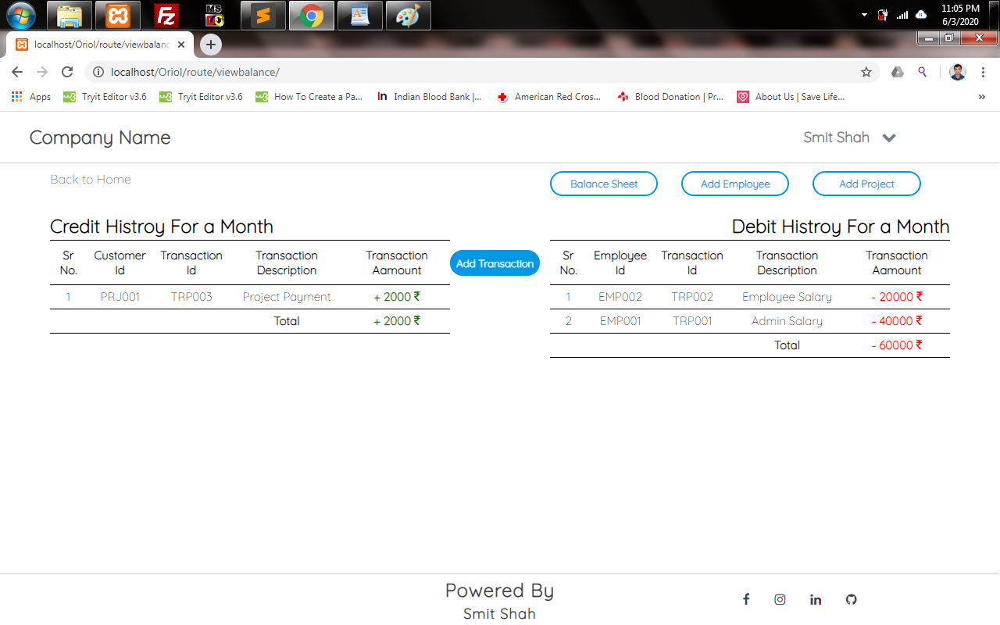
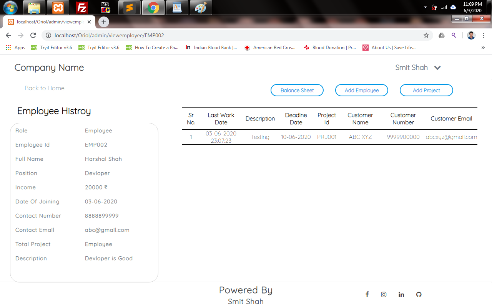

# Employee ERP System

A comprehensive Employee Resource Planning (ERP) system built with PHP and CodeIgniter framework for managing employee data, projects, and daily work tracking.

## 📋 Overview

This ERP system is designed to streamline business process management by providing an integrated application for managing employees and projects. The system offers role-based access control with separate interfaces for administrators and employees.

### Key Features

- **Admin Features:**
  - Add, update, and delete employee details
  - Create and manage customer projects
  - View comprehensive employee reports
  - Monitor project history and progress
  - Track financial transactions and balance sheets

- **Employee Features:**
  - Personal dashboard access
  - Daily work log updates
  - View assigned projects
  - Track personal work history

## 🛠️ Technology Stack

- **Backend:** PHP 7.4+ (CodeIgniter 3.x Framework)
- **Database:** MySQL 5.7+
- **Frontend:** HTML5, CSS3, JavaScript
- **Dependencies:** jQuery, Google Fonts (CDN)
- **Server:** Apache (XAMPP/WAMPP)

## 📋 Prerequisites

Before installing the Employee ERP System, ensure you have:

- **XAMPP/WAMPP Server** - Download from [Apache Friends](https://www.apachefriends.org/download.html)
- **Text Editor** (VS Code, Sublime Text, Notepad++, etc.)
- **Web Browser** (Chrome, Firefox, Safari, etc.)
- **Internet Connection** (for CDN resources)

## 🚀 Installation Guide

### Step 1: Setup Web Server

1. Download and install XAMPP from the official website
2. Start Apache and MySQL services from XAMPP Control Panel

### Step 2: Project Setup

1. Extract the project files
2. Copy the contents of `Employee ERP Source File` to your web server directory:
   ```
   C:\xampp\htdocs\ERP\
   ```
3. Rename `htaccess` to `.htaccess` in the project root

### Step 3: Database Configuration

1. Open your browser and navigate to `http://localhost/phpmyadmin`
2. Create a new database named `ERP_System`
3. Import the database:
   - Click "Import" tab
   - Choose file: `Database/Database.sql`
   - Click "Go" to import

### Step 4: Configuration

Update database settings in `application/config/database.php` if needed:
```php
$db['default'] = array(
    'hostname' => 'localhost',
    'username' => 'root',
    'password' => '',
    'database' => 'ERP_System',
    // ... other settings
);
```

## 🎯 Running the Application

1. Start XAMPP services (Apache & MySQL)
2. Open your web browser
3. Navigate to: `http://localhost/ERP/`

## 🔐 Default Login Credentials

### Administrator Access
- **Email:** admin@gmail.com
- **Password:** 1234567890

### Employee Access
- **Email:** [Employee's registered email]
- **Password:** [Employee's contact number]

## 📁 Project Structure

```
EmployeeERP-web/
├── Database/
│   └── Database.sql              # Database schema and initial data
├── Employee ERP Source File/
│   ├── application/
│   │   ├── config/              # Configuration files
│   │   ├── controllers/         # Business logic controllers
│   │   ├── models/              # Data access layer
│   │   └── views/               # User interface templates
│   ├── Assest/
│   │   └── Css/                 # Stylesheets
│   └── .htaccess                # URL rewriting rules
├── ScreenRecord/                # Demo video
├── SnapShot/                    # Application screenshots
└── README.md                    # Project documentation
```

## 🖼️ Application Screenshots

### Admin Interface





### Employee Interface



### Reports & Analytics



## 🎥 Demo Video

A complete demonstration of the system functionality is available in the `ScreenRecord/` directory.

## 🔧 Troubleshooting

### Common Issues

1. **Database Connection Error**
   - Verify MySQL is running
   - Check database credentials in config files
   - Ensure database `ERP_System` exists

2. **404 Error / Routing Issues**
   - Verify `.htaccess` file exists and is properly configured
   - Enable Apache mod_rewrite module

3. **Permission Errors**
   - Ensure proper file/folder permissions
   - Check if web server has read/write access

## 🤝 Contributing

1. Fork the repository
2. Create a feature branch (`git checkout -b feature/new-feature`)
3. Commit your changes (`git commit -am 'Add new feature'`)
4. Push to the branch (`git push origin feature/new-feature`)
5. Create a Pull Request

## 📝 License

This project is open source and available under the [MIT License](LICENSE).

## 📞 Support

For support and questions, please create an issue in the repository or contact the development team.

---

**Note:** This application requires an internet connection for CDN resources (jQuery, Google Fonts). Ensure you have a stable internet connection for optimal performance.
